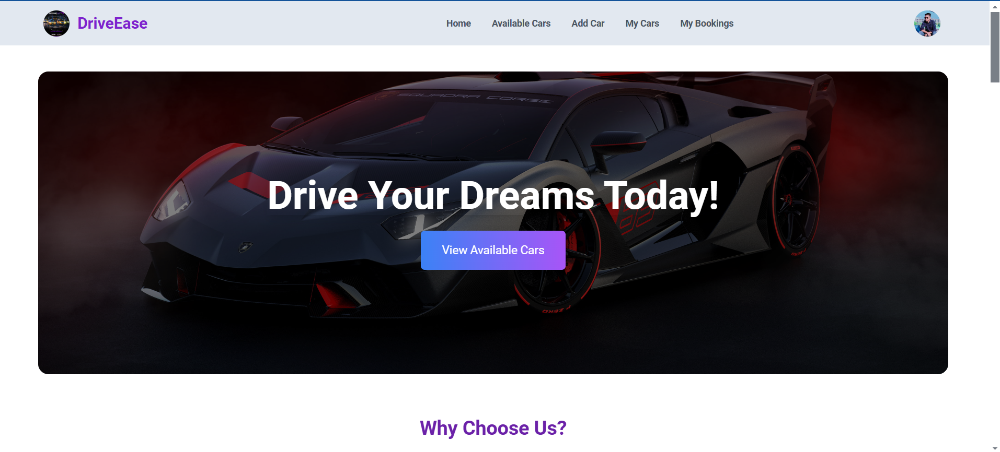

# 🚗 Car Rental System

**Live Link:** [Car Rental System](https://driveease1.netlify.app/)  
**Client Repository:** [GitHub - Client](https://github.com/tareqahmed2/driveease)  
**Server Repository:** [GitHub - Server](https://github.com/tareqahmed2/driveease-server-side)

---



## Project Overview

The Car Rental System is a feature-rich, user-friendly platform designed to streamline car rentals for users. This system enables seamless car bookings, user authentication, and efficient management of car inventory.

**Main Technologies Used:**

- **Frontend:** HTML, CSS, JavaScript, React.js, Tailwind CSS
- **Backend:** Node.js, Express.js, MongoDB
- **Authentication:** Firebase Authentication, JWT
- **Charting Library:** Recharts
- **Deployment:** Vercel (Client), Render (Server)

---

## Key Features

### User Features

- **Car Management:** Users can add, update, and delete cars.
- **Booking System:** Search and book cars based on availability.
- **Real-time Updates:** Real-time booking status and availability updates.
- **Responsive Design:** Fully responsive for mobile, tablet, and desktop.
- **Sorting:** Sort cars by price or date added.
- **Data Visualization:** View rental price trends on the "My Bookings" page using Recharts.
- **Private Routes:** Secured pages like "Add Car," "My Cars," and "My Bookings" for authenticated users.

### Admin Features

- **JWT Authentication:** Secure authentication for private routes and API access.
- **Server-side Pagination:** Efficiently manage large datasets on the "My Cars" page.
- **Incremental Updates:** Track car bookings using MongoDB `$inc` operators.

---

## Pages and Functionalities

1. **Home Page:**

   - **Banner Section:** Eye-catching heading and call-to-action button.
   - **Why Choose Us Section:** Highlights platform benefits with icons.
   - **Recent Listings Section:** Displays latest car listings in a grid layout.
   - **Special Offers Section:** Showcases deals with animations.

2. **Available Cars Page:**

   - Toggle between grid and list views.
   - Search cars by model, brand, or location.
   - Sorting by price or date added.
   - "Book Now" button for quick booking.

3. **Add Car Page (Private):**

   - Add new cars with details like model, price, features, and availability.

4. **My Cars Page (Private):**

   - Manage added cars with sorting, updating, and deleting options.
   - Real-time table updates after actions.

5. **My Bookings Page (Private):**

   - Tabular layout with details of all bookings.
   - Modify booking dates or cancel bookings.
   - Visualize daily rental prices using Recharts.

6. **Authentication:**

   - Login and Registration using Firebase and Google Sign-In.
   - JWT for secured API access.

7. **Error Page:**
   - A custom 404 page with navigation back to Home.

---

## Dependencies

### Frontend

- **React.js:** Core frontend framework.
- **Tailwind CSS:** Utility-first CSS framework.
- **Recharts:** Data visualization library.
- **React Router DOM:** Client-side routing.

### Backend

- **Node.js & Express.js:** Backend runtime and framework.
- **MongoDB:** Database for storing data.
- **Firebase Admin SDK:** Authentication handling.
- **dotenv:** Environment variable management.

---

## How to Run Locally

### Prerequisites

- **Node.js** and **npm/yarn** installed.
- **MongoDB** setup locally or via a cloud service.
- Firebase project credentials.

### Steps

1. **Clone the repositories:**
   ```bash
   git clone https://github.com/tareqahmed2/driveease-server-side
   git clone https://github.com/tareqahmed2/driveease
   ```
